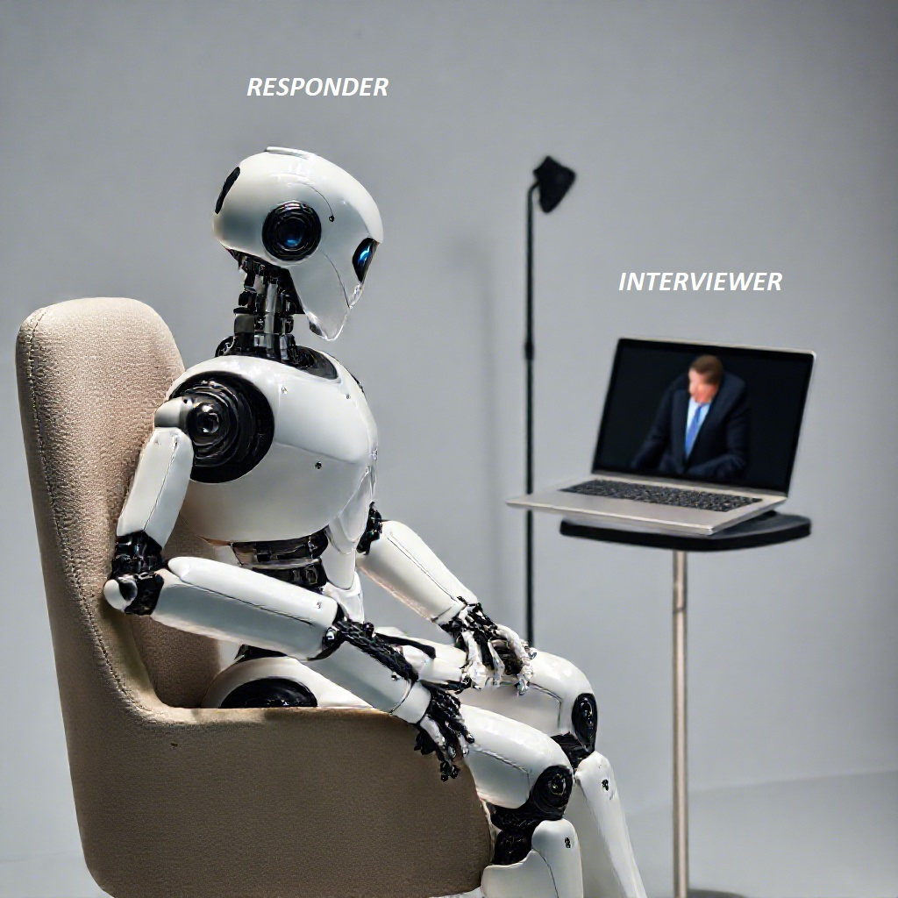

<!-- At first glance, the branding and messaging clearly conveys what to expect -->
<div align="center">

[](https://www.linkedin.com/in/mouafo-kamgno-keryan-gift-017403292/)
[](mailto:mouafokeryan@gmail.com)

You can ask your questions here in my telegram group.

[](https://t.me/+_eppACRhjXhlMjE0)
</div>
<br />

# 🚀Advanced_Interview_Responder_with_AI

The **Advanced Interview Responder** is a cutting-edge tool designed to assist users during interviews by leveraging artificial intelligence. It generates contextually relevant responses based on the user's resume and interview questions, displayed in real-time on a teleprompter interface. This allows users to maintain eye contact with the interviewer while confidently delivering their answers.

## ✨ Features

- **🤖 AI-Generated Responses**: Utilizes OpenAI's GPT model to create tailored responses based on the user's resume and interview questions.
- **🎤 Speech Recognition**: Uses the Vosk speech recognition model to transcribe audio questions in real-time for seamless interaction.
- **📺 Teleprompter Interface**: A user-friendly GUI displays AI-generated responses clearly, helping users deliver answers confidently.
- **📄 Resume Parsing**: Extracts relevant information from the user's PDF resume to provide context for the AI's responses.
- **⌨️ Keyboard Control**: Enables users to pause and resume the application using keyboard shortcuts for greater control during practice sessions or live interviews.

## 🛠️ How It Works

1. **📑 Resume Data Extraction**: The application reads the user's resume and extracts key information to inform the response generation process.
2. **🗣️ Real-Time Question Transcription**: As the interviewer asks questions, the application listens and transcribes them using speech recognition technology.
3. **🧠 Contextual Response Generation**: The AI processes the transcribed question along with the resume data to generate a relevant response.
4. **📢 Display on Teleprompter**: The generated response is displayed on the teleprompter interface, enabling the user to read the answer while engaging with the interviewer.

## 🧩 Installation

[watch my YouTube video on how to setup](https://youtu.be/WN9aiMDKxFw?si=LWV4OSmOn5myTUAU) And detailed explanation.
### 📋 Prerequisites

- [Python 3.12.4 AND ABOVE](https://www.python.org/downloads/) installed on your system
- An [OpenAI API key](https://platform.openai.com/account/api-keys) (replace `"your_openai_api_key_here"` in the code with your actual API key)
- Vosk speech recognition model (download from [Vosk Models](https://alphacephei.com/vosk/models)
- Here’s a list of Vosk English speech recognition models and their system requirements:

### 1. **Lightweight English Models**
   - **Model size**: ~50 MB
   - **System requirements**:
     - **RAM**: Minimum 1 GB
     - **CPU**: Mid-range CPU (equivalent to Raspberry Pi or Android devices)
     - **Performance**: Suitable for real-time offline speech recognition on constrained devices【7†source】【8†source】.

### 2. **Large English Models for Quality listening**
   - **Model size**: 1.4 GB to 4.4 GB
   - **System requirements**:
     - **RAM**: 4 GB or more recommended
     - **CPU**: Multi-core processors
     - **Performance**: Designed for server environments with better accuracy but higher resource consumption【8†source】【9†source】.

### 📦 Libraries

The application requires the following libraries:

- **Vosk**: For speech recognition
- **PyAudio**: For audio input and processing
- **OpenAI**: For interacting with the OpenAI API
- **PyPDF2**: For reading PDF files
- **Tkinter**: For creating the GUI (included with Python)
- **Keyboard**: For detecting keyboard events

### 📄 Requirements File

The required libraries and their versions are listed in the `requirements.txt` file. You can install them using the following command:

```bash
pip install -r requirements.txt
```

The `requirements.txt` file includes:

```
vosk==0.3.45
pyaudio==0.2.14
openai==1.37.1
PyPDF2==3.0.1
keyboard==0.13.5
```

### ▶️ Running the Application

[watch my YouTube video on how to setup](https://youtu.be/WN9aiMDKxFw?si=LWV4OSmOn5myTUAU) and detailed explanation.

You can run the application using one of the following methods:

#### 🔧 Method 1: Using a Virtual Environment

Creating a virtual environment is recommended to manage dependencies separately from your global Python installation.

1. **Clone the Repository**:

   ```bash
   git clone https://github.com/Gamingpro237/Advanced_Interview_responder_with_AI.git
   cd Advanced_Interview_responder_with_AI
   ```

2. **Create a Virtual Environment**:

   ```bash
   python -m venv venv
   ```

3. **Activate the Virtual Environment**:

   - **On Windows**:

     ```bash
     venv\Scripts\activate
     ```

   - **On macOS and Linux**:

     ```bash
     source venv/bin/activate
     ```

4. **Install the Required Libraries**:

   ```bash
   pip install -r requirements.txt
   ```

5. **Download and Specify the Path for the Vosk Model**.

6. **Run the Application**:

   ```bash
   python main.py
   ```

7. **Deactivate the Virtual Environment** (after you're done):

   ```bash
   deactivate
   ```

#### ⚙️ Method 2: Normal Setup (Without Virtual Environment)

If you prefer to install the dependencies globally without using a virtual environment, follow these steps:

1. **Clone the Repository**:

   ```bash
   git clone https://github.com/Gamingpro237/Advanced_Interview_responder_with_AI.git
   cd Advanced_Interview_responder_with_AI
   ```

2. **Install the Required Libraries**:

   ```bash
   pip install -r requirements.txt
   ```

3. **Download and Specify the Path for the Vosk Model**.

4. **Run the Application**:

   ```bash
   python main.py
   ```

## 💼 Applications

The Advanced Interview Responder can be utilized in various scenarios, including:

- **💼 Job Interviews**: Candidates can practice with the AI to prepare for real interviews, receiving tailored answers based on their resumes.
- **💻 Virtual Meetings**: During online meetings or webinars, users can ask questions and get immediate AI-generated responses to enhance their presentations.
- **🎤 Public Speaking**: Individuals can practice speeches and receive feedback on their delivery by reading AI-generated content.
- **🏢 Corporate Training**: New employees can use the tool for onboarding, helping them prepare for real-world interactions and interviews.

## 📝 Conclusion

The Advanced Interview Responder with AI is a valuable tool for anyone looking to enhance their interview skills and communication abilities. By combining AI-generated responses with a teleprompter interface, it provides users with a unique and effective way to prepare for and navigate interviews confidently.

## 📜 License

This project is licensed under the MIT License. See the [LICENSE](LICENSE) file for details.
